# 教室で使えるかもしれないもの作り #◯ 「読書カード、集めて数えるのが大変」。ピッとためる読書通帳アプリ「どくしょ ちょきんばこ」

## 🏫 はじめに

読書の記録カード、学期のおわりに集めて数えるのが大変ではありませんか。

一人ひとりのカードを開いて、冊数を数えて、名簿に書きうつす。せっかく子どもたちが書いてくれたのに、集計だけで放課後がひとつ消えてしまう。しかも子どものほうも、書くのがめんどうになって、いつのまにか白いままのカードが机の奥から出てくる。読書そのものは楽しいのに、記録のところで止まってしまうのは、もったいないと思うのです。

そこで作ったのが「どくしょ ちょきんばこ」です。読んだ本のうらにあるバーコードを、タブレットのカメラで読ませるだけ。本の名前も、かいた人も、ページ数も、ねだんも、自動で入ります。そして冊数だけでなく、読んだページ数と、その本のねだんの合計が「ちょきん」のようにたまっていきます。

使うところはこちらです。

https://reading-books.giga-school.com/

アカウントもログインもありません。名前も出席番号も入力しません。リンクを配れば、その日から使えます。

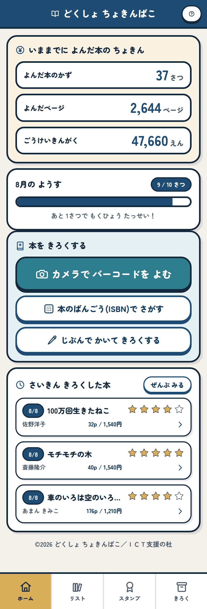

トップページ。読んだ冊数、ページ数、金額の合計が、いちばん上にならびます。

## 📱 このアプリでできること

画面は下の4つに分かれています。ホーム、リスト、スタンプ、きろく。それだけです。子どもが迷子にならない数に絞りました。

本を記録する入口は3つあります。カメラでバーコードを読む、番号を打ちこむ、じぶんで書く。上から順に楽な順です。

いちばん使ってほしいのはカメラです。本のうらの978からはじまるバーコードにカメラを向けると、真ん中の枠にピントが合った瞬間に読み取って、そのまま本を探しにいきます。子どもがすることは、本をかざすことだけです。

ここで一つだけ、はじめに伝えておいてほしいことがあります。日本の本のうらには、バーコードが上下に2本ならんでいます。上の978からはじまるほうが本の番号で、下の192からはじまるほうはねだんの番号です。下を読んでしまう子は必ず出るので、そのときは「それはねだんのバーコードだよ。上の978のほうを読んでね」と画面が教えてくれます。それでも最初の一回だけは、先生の口から言っておくと早いです。

図書室の本はラベルでバーコードが隠れていることがあります。そのときは番号を打ちこむ入口を使います。うらの数字を13けた打てば同じように探せますし、古い本にある10けたの番号でも受けつけます。

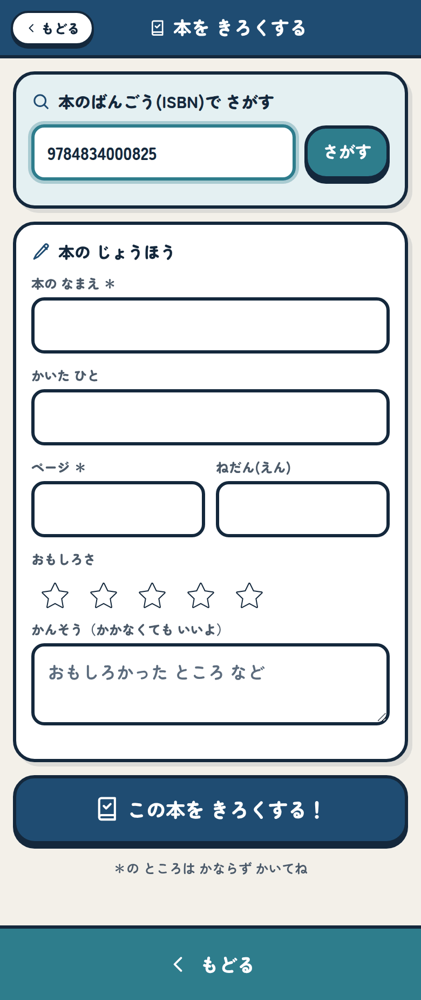

数字を入れて「さがす」を押すだけ。10けたの古い番号を入れると、13けたに直してから探します。

それでも見つからない本はあります。むかしの蔵書や、バーコードのない本です。そのときは手で書きます。書く欄はたくさんありますが、かならず要るのは本の名前とページ数の2つだけにしました。かいた人もねだんも空のままで記録できます。ここを厳しくすると、いちばん記録したい子が止まってしまうからです。

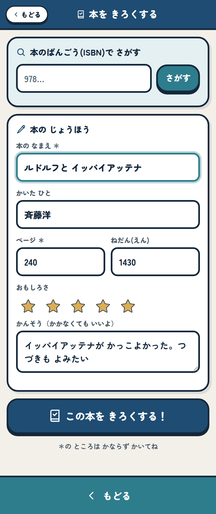

手で書くときの画面。かならず要るのは、本の名前とページ数の2つだけです。おもしろさの星と、かんそうは、あとから足せます。

同じ本をもう一度記録しようとすると、こう出ます。

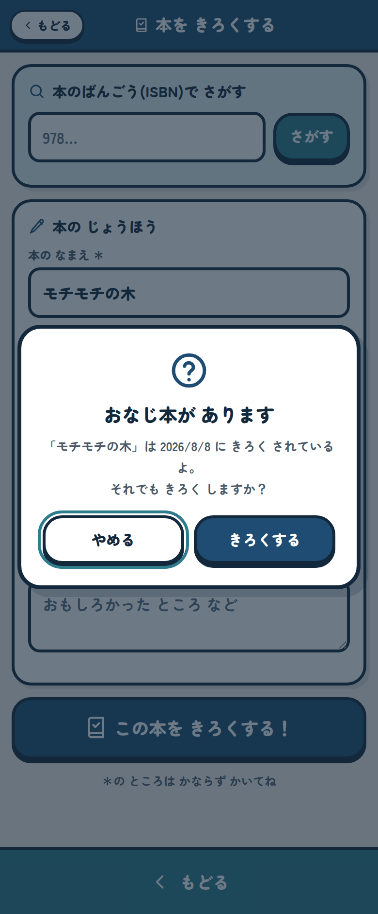

前に読んだ本をもう一度読むこともあるので、止めてはいません。えらべるようにしてあります。

記録した本は「リスト」にたまります。この月、この年、ぜんぶ、と切りかえられて、そのときどきの合計が上に出ます。

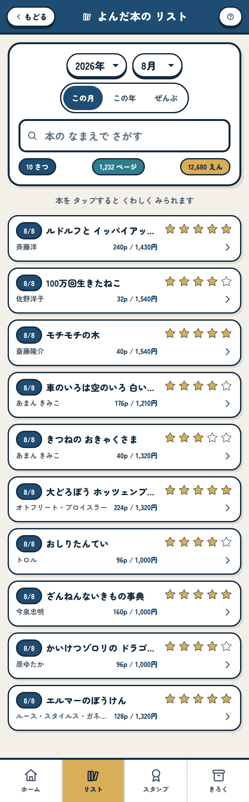

えらんだ月の冊数、ページ数、金額が、そのままならびます。

「この年」に切りかえると、その年に読んだものが全部つながって出てきます。学期のふりかえりのときは、こちらのほうが見やすいと思います。

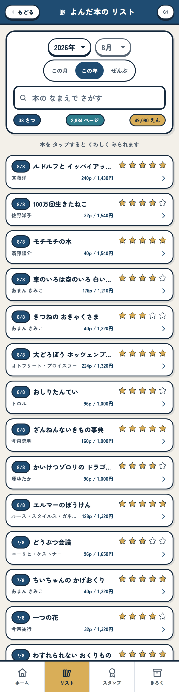

上の数字だけを見ても、その子がどれだけ読んだかが分かります。

本の名前とかいた人で探すこともできます。「あの本、いつ読んだんだっけ」を、そのまま打ちこめば出てきます。

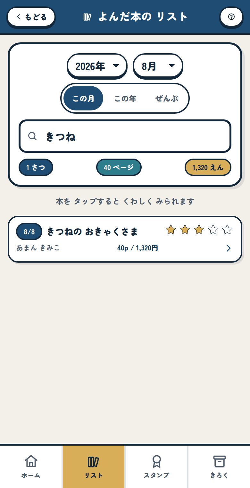

「きつね」と打つと、題名にきつねが入っている本だけが残ります。

本をタップすると、その1冊のくわしい画面になります。ここで、おもしろさの星をつけたり、かんそうを書き足したりできます。

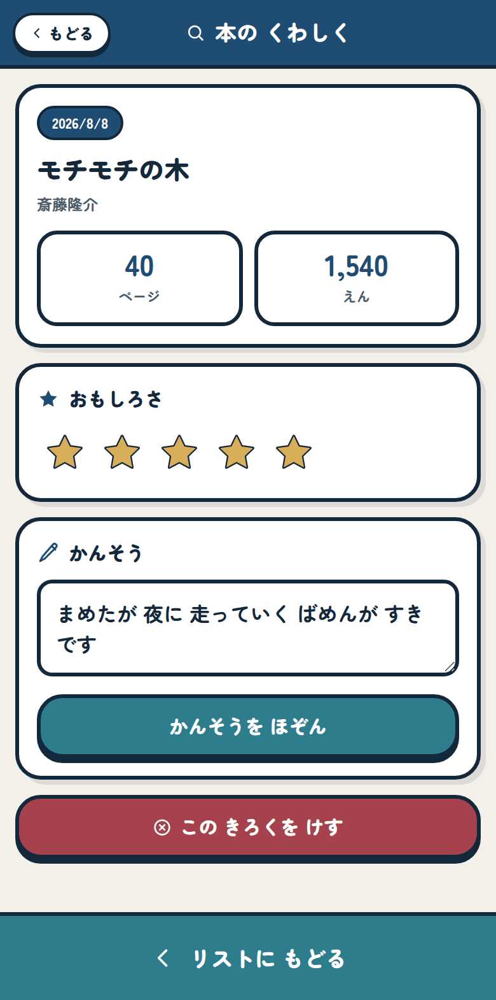

読んだ直後は星だけ、あとで思い出したらかんそうを足す。そんな使い方ができます。

前の月の分をあとから入れることもできます。リストかスタンプで年月をえらんでから記録すると、その月の記録になります。入れる画面に金色で「このきろくは2026年6月になります」と出るので、いま入れている月をまちがえません。

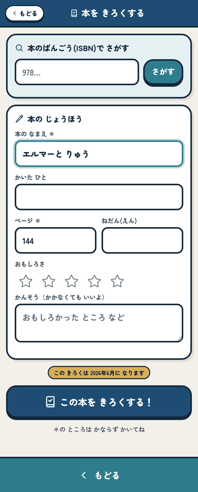

長い休みのあとにまとめて入れるときや、書きためた紙のカードから移すときに使えます。

## 💰 冊数だけでなく、ページとねだんもためる

読書の記録というと、ふつうは冊数だけを数えます。でも冊数だけだと、うすい絵本を10冊読んだ子と、分厚い物語を1冊読み切った子が、まったく別の見え方になってしまいます。読み切った子のがんばりが、数字の上では小さく見えてしまうのです。

だからこのアプリは、ページ数もためます。そしてもう一つ、本のねだんもためます。

なぜねだんなのか。読書は目に見えにくいからです。50冊読んだと言われてもぴんとこない子でも、「今までに読んだ本を全部買っていたら、49,090円ぶんだよ」と言われると、急に大きさが分かります。図書室の本をこれだけ使わせてもらった、という重さも伝わります。貯金箱に小銭がたまっていくのと同じ手ざわりを、読書に持ちこみたかったのです。

これが「ちょきんばこ」という名前の理由です。

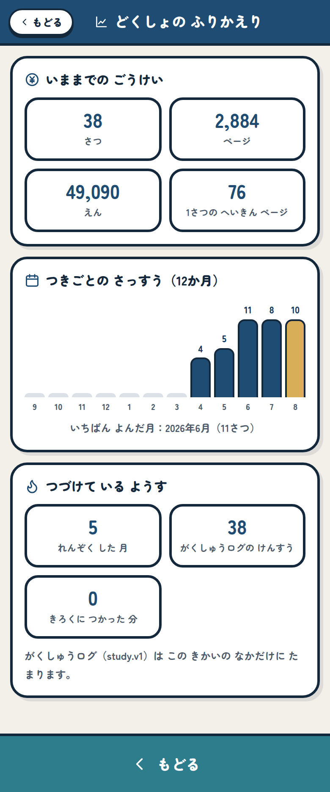

「きろく」から開くふりかえり。月ごとの冊数がならび、いちばん読んだ月と、続けてきた月の数が出ます。

グラフは12か月ぶんです。棒がだんだん伸びていくのが見えると、続ける気持ちになりやすいのではないかと思っています。1冊あたりの平均ページ数も出るので、「うすい本ばかりになっていないかな」と自分で気づくきっかけにもなります。

## 🏅 月の目標と、たまっていくスタンプ帳

もう一つの柱がスタンプ帳です。

月ごとに目標の冊数を決めます。はじめは10冊にしてありますが、1冊から99冊まで、子どもが自分で決められます。読むのが苦手な子が3冊にしてもいいし、どんどん読む子が30冊にしてもいい。学級で一律にしなかったのは、他の子と比べるための数字にしたくなかったからです。

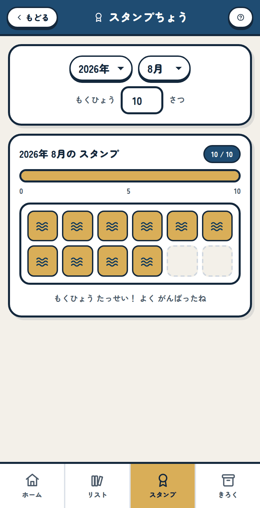

1冊読むごとにスタンプが1つ。目標に届くとバーが金色になります。

スタンプの絵柄は月ごとに変わります。12か月ぶん、それぞれ別の絵を用意しました。月がかわると絵柄が変わるので、「今月のスタンプはどんな形だろう」と開いてもらえたらうれしいです。

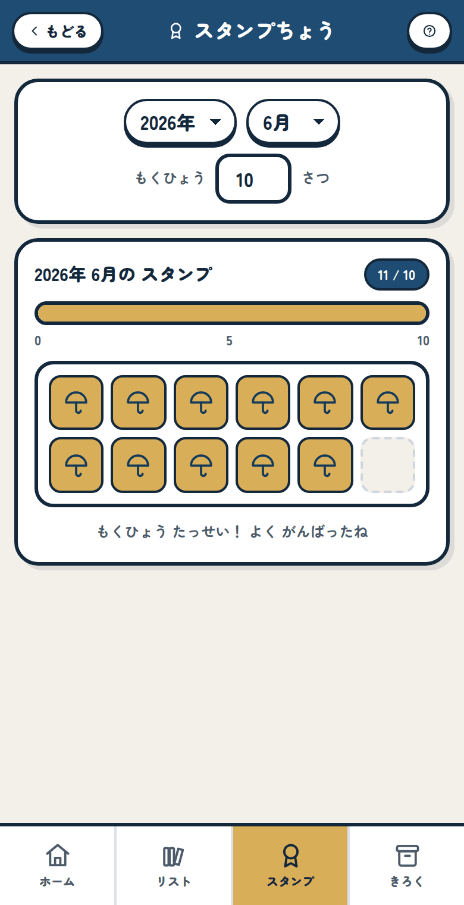

同じ画面で月を切りかえると、その月に集めたスタンプが出てきます。絵柄がちがうのが分かります。

そして目標に届いた月は、その月にはじめて届いた一回だけ、紙ふぶきとファンファーレでお祝いします。

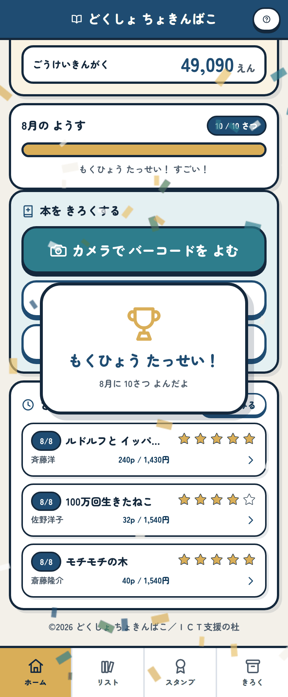

10冊目を記録した瞬間の画面。同じ月に何度も出ることはありません。

何度も出るとうるさくなるので、一回だけにしました。動きが気になる子のために、端末の設定で「視差効果を減らす」をオンにしていると紙ふぶきは出ません。音も、あとから出てくる設定で切れます。

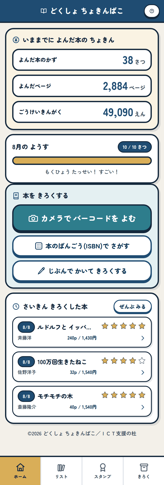

届いたあとは、進み具合のバーが金色のまま残ります。

## ✨ 導入のメリット

三つのいいことが期待できます。

一つ目は、先生の集計がなくなることです。冊数もページ数も金額も、子どもが記録した時点で合計されています。学期末にカードを集めて数える作業が、そのままなくなります。学級全体の記録をまとめたいときは、あとで書く「ひょうにコピー」を使えば、そのままスプレッドシートに貼れます。

二つ目は、子どもが自分の読書量を自分で見られることです。先生に言われて数えるのではなく、自分の貯金箱が増えていくのを自分で見る。読書の記録が、提出物ではなく自分のものになります。続けるかどうかを決めるのは、通知表ではなく、たまっていく数字のほうがいいと思うのです。

三つ目は、家庭に伝えやすくなることです。A4の紙1枚に読んだ本が全部ならぶので、授業参観でも懇談でも、そのまま見せられます。「よく本を読んでいます」と口で言うより、読んだ本のならんだ紙を見てもらうほうが早いです。

## 🖨️ 紙1枚にまとまる

このアプリで先生にいちばん使ってほしいのが、この印刷です。

「きろく」の中の「データを のこす・よみこむ」を開いて、いちばん下の「いんさつの がめんを ひらく」を押すと、その時点の記録が全部、古い順にならんだ紙が出ます。

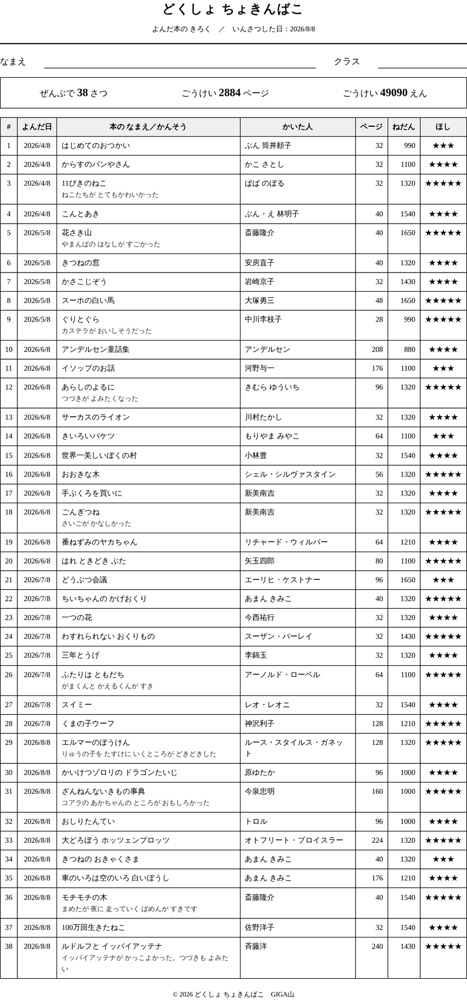

A4のたて1枚。なまえとクラスは手書きの欄です。アプリは名前を持たないので、ここだけは紙の上で書いてもらいます。

通し番号、読んだ日、本の名前、かんそう、かいた人、ページ数、ねだん、おもしろさの星。全部そろっています。表が2ページ目に続くときは、見出しの行が2ページ目にも出るようにしてあるので、途中から見ても何の列か分かります。1冊ぶんの行が途中で切れることもありません。

読書週間のまとめ、懇談の資料、学年末の持ち帰り。紙にしたい場面はまだ残っていると思うので、そこはちゃんと紙にできるようにしました。

## 🛠️ 【管理者向け】導入手順

情報担当の先生に聞かれることを、先に全部書いておきます。

導入でやることは3つだけです。

1. 上のURLを子どもたちに配る。Classroomでも、ブックマークでも、QRコードでもかまいません
2. 端末で「ホーム画面に追加」をしてもらう
3. 「バーコードは978からはじまるほうを読む」と一度だけ伝える

インストールも、先生用の管理画面も、初期設定もありません。

個人情報については、持たない作りにしてあります。氏名も、出席番号も、メールアドレスも、入力させる場所がアプリのどこにもありません。記録はその端末の中だけに残り、インターネットに送られることはありません。サーバーもないので、こちらに記録が集まる仕組みそのものがありません。Cookieも広告もアクセス解析も入れていません。

校内のフィルタリングで許可が必要になるのは4つです。アプリ本体のある reading-books.giga-school.com と、本の情報を調べにいく api.openbd.jp、www.googleapis.com、ndlsearch.ndl.go.jp です。最後のひとつは国立国会図書館サーチです。

本の情報は、このうしろの3か所を同時に調べて、そろったものから使います。どこにも送っているのは本の番号の数字だけで、子どもに関する情報は一切ふくみません。3か所とも遮断されている学校でも、手で書く入口が残っているので、記録そのものは続けられます。時間がかかりすぎるときは6秒でうちきって、分かったところまで入れます。1つのサービスが遅いだけで子どもを待たせないためです。

アプリの通信先は、この3か所と自分自身に限るように設定してあります。ほかのどこかに勝手につながることはありません。

カメラは、はじめて使うときにブラウザが許可を聞いてきます。Chromebookで一括して許可を出しておくと、子どもがつまずきません。カメラが使えない端末でも、番号を打ちこむ入口と手で書く入口があるので、記録はできます。

共用の端末をお使いの場合は、記録が端末ごとに残ることに気をつけてください。同じ端末を別の子が使うと、前の子の記録が見えます。1人1台の端末でお使いいただくのがいちばんですが、共用にせざるを得ないときは、あとで書くファイルへの書き出しで、その子の記録を持ち歩いてもらう形になります。

端末ごとに気をつけることが2つあります。

iPadとiPhoneをお使いの場合、Safariには「7日間使わなかったサイトの保存データを消す」しくみがあります。ホーム画面に追加しておくと消えにくくなるので、これは必ずやっておいてください。長い休みの前には、あわせてファイルに保存しておくと安心です。

Chromebookは、メモリが足りなくなるとタブを捨てることがあります。かんそうを書いている途中で消えないように、画面を離れるときにその場で保存するようにしてありますが、こちらも長い休みの前には書き出しをおすすめします。

一度開いたあとは、インターネットが切れていても起動します。本の情報を調べるときだけインターネットが要ります。校外学習や、回線が細い時間帯でも、記録そのものは止まりません。

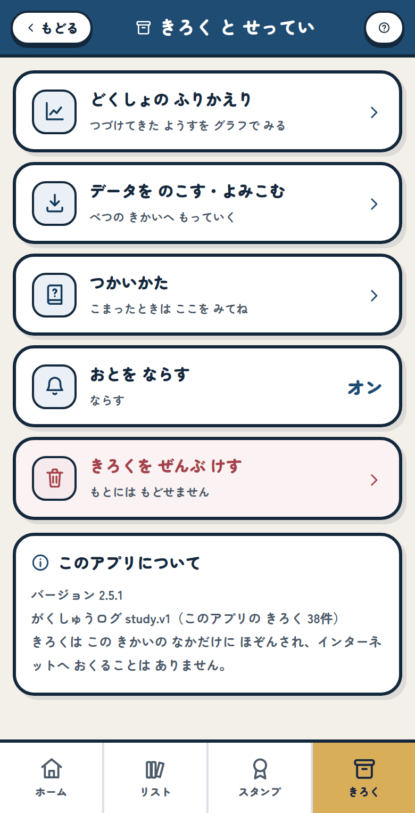

「きろく」を開くと、ふりかえり、データの保存、つかいかた、音の切りかえ、記録を消す、がならびます。

記録を消す機能は、いちばん下に赤色で置いてあります。押すと確認の画面になり、そこから先に保存もできます。

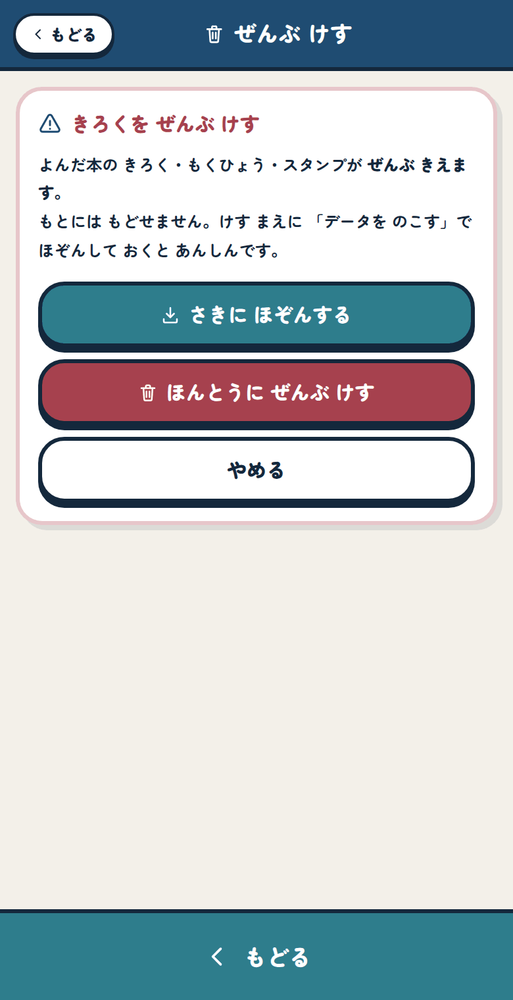

消える前に「さきに ほぞんする」を押せます。消えるのはこのアプリの記録だけで、ほかの学習アプリの記録には手を出しません。

すでに学習ポータルの「まなびクエスト」をお使いの学校では、そちらにも記録が届きます。このアプリは端末に保存するだけで、送るのはポータルの側です。送られるのは本の題名やページ数といった読書の中身だけで、氏名や出席番号はふくみません。使っていない学校では、何もしなくてかまいません。

パソコンやChromebookの広い画面では、横に2列にならびます。教室の大型提示装置に映して説明するときも、そのまま使えます。

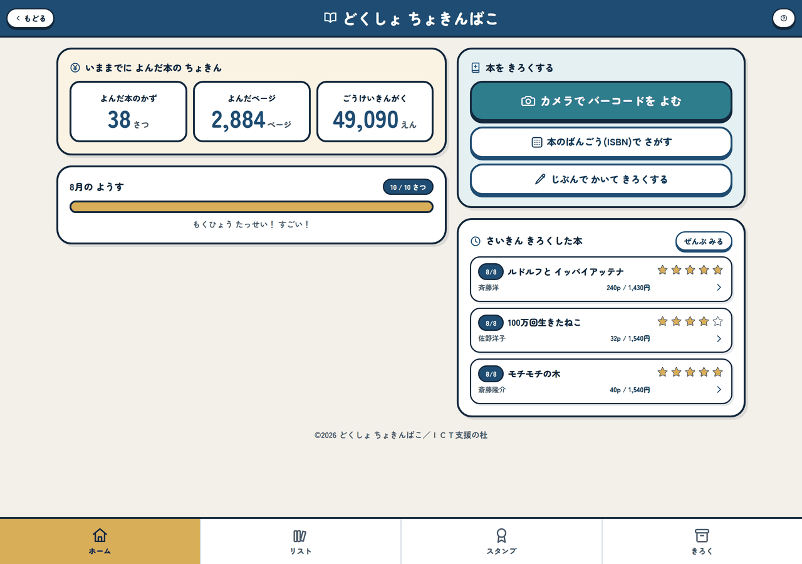

画面が広いときは自動で2列になります。

## 📖 【利用者向け】使い方のガイド

子どもたちに渡すときの手順です。この順で伝えると迷いません。

1. 配られたURLを開く
2. 下の「きろく」を開いて「アプリとして インストール」を押す。iPadの場合は共有ボタンから「ホーム画面に追加」を押す
3. ホームの「カメラで バーコードを よむ」を押す
4. 本のうらの、978からはじまるバーコードに、画面のまん中の枠を合わせる。本は20センチから25センチくらい離す
5. 「よめました！」と出たら、本の名前とページ数が入っているか見る。赤くなっている欄があったら、本を見て自分で書き足す
6. おもしろさの星をつけて、かんそうを書く。書かなくても記録できる
7. 「この本を きろくする！」を押す

うまく読めないときの手当ても、順番にしてあります。

1. ピントが合わないときは、本を少し離す
2. 暗いときは「ライト」を押す。対応している端末だけに出ます
3. 光ってしまうときは、蛍光灯の真下をさけて、本を少しななめにする
4. 何度やっても読めないときは「ばんごうで いれる」を押して、バーコードの下の978からはじまる数字を打ちこむ
5. バーコードがない古い本は、ホームの「じぶんで かいて きろくする」から、題名とページ数を手で入れる

こまったときは、アプリの中にも説明を入れてあります。

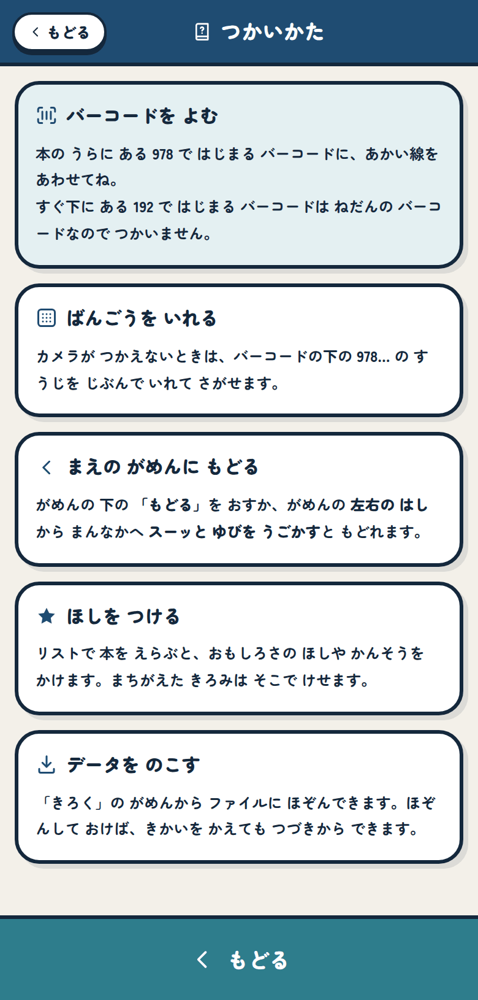

右上の「?」からも、「きろく」の中からも開けます。

月の目標を変えたいときは、スタンプの画面の右上にある数字を書きかえます。1から99までです。

端末を入れかえるときや、進級で端末が変わるときは、先に記録を書き出しておいてください。

1. 「きろく」を開いて「データを のこす・よみこむ」を開く
2. 「ファイルに ほぞんする」を押す
3. 出てきたファイルを、Googleドライブなどに置いておく
4. 新しい端末で同じ画面を開き、「ファイルを えらぶ」からそのファイルを選ぶ
5. 今の記録に足すか、まるごと入れかえるかを選ぶ

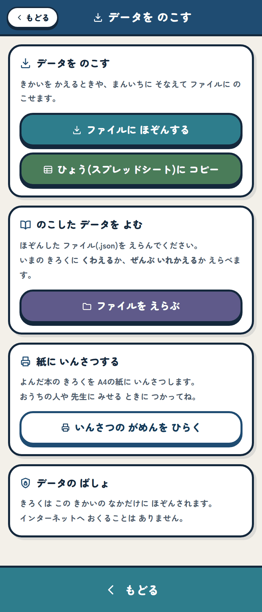

同じ画面にある「ひょう(スプレッドシート)に コピー」を押すと、そのまま表計算ソフトに貼りつけられる形でコピーされます。学級の記録をまとめたいときは、こちらが便利です。

足すほうを選んだときは、すでにある記録と同じものが二重に入らないようにしてあります。

## 📝 まとめ

このアプリで減らしたかったのは、読書のじゃまをしている事務仕事です。

カードを集めて数える時間、名簿に書きうつす時間、子どもが記録を書くのをためらう時間。どれも、読書そのものとは関係のないところで消えていく時間でした。そこをアプリに任せてしまえば、先生は「その本、どこがおもしろかった？」と聞くほうに時間を使えます。読書指導でいちばん効くのは、たぶんその一言のほうだと思うのです。

子どものほうも同じです。記録が1秒で終われば、記録は義務でなくなります。たまっていく数字を見て、次の本を選びにいく。そういう回り方になればいいと思って作りました。

作りながら、いくつかあえてやらなかったことがあります。学級のランキングは作りませんでした。読んだ量で子どもを並べるのは、このアプリのやることではないと考えたからです。目標の冊数も、先生が決めるのではなく子どもが決める形にしました。名前を入力させないのも同じ理由です。だれの記録かは、その端末を持っている子が知っていればいい。それ以上の情報は、このアプリには要りませんでした。

ICTでできることは、まだ小さなことばかりです。それでも、放課後の集計がひとつ消えて、そのぶん子どもと本の話ができるなら、作った意味はあったと思います。

うまくいかないところがあれば、遠慮なく教えてください。教室で使ってみて気づいたことほど、次に直すべきところがはっきり分かるものはありません。

一歩踏み出そうとする先生を、私はいつでも全力で応援しています。
